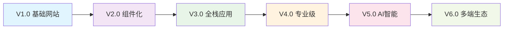

# FigmaToCode：设计师转前端开发者

<div align="center">

**🎨 专为UI/UX设计师设计的全栈开发学习计划**

[](https://kklauden.github.io/FigmaToCode/)
[](https://jekyllrb.com/)
[](LICENSE)

[📖 学习网站](https://kklauden.github.io/FigmaToCode/) • [📝 开发日志](https://kklauden.github.io/FigmaToCode/devlog/) • [📰 技术资讯](https://kklauden.github.io/FigmaToCode/news/)

</div>

---

## 🎯 项目愿景

在 AI 时代，设计师与开发者的边界正在消失。**FigmaToCode** 致力于帮助熟练使用 Figma 的 UI 设计师，通过 AI 协作的方式，高效掌握现代前端技术栈，成为具备全栈开发能力的复合型人才。

### 🌟 核心特色

- **🚀 AI 优先学习**：基于 2025 年最新 AI 编程工具，降低技术门槛
- **🎨 设计师思维**：用设计师熟悉的概念解释技术原理
- **📈 项目驱动**：从 V1.0 到 V6.0，逐步打造完整作品集网站
- **🔄 渐进式路径**：6 个模块，400+ 小时精心设计的学习内容

---

## 🛤️ 学习路径

### 📚 模块设计

| 模块 | 名称 | 技术栈 | 产出 | 难度 |
|-----|------|-------|------|------|
| **00** | AI 编程环境配置 | VS Code + OpenAI Codex | 开发环境 + AI 协作体验 | ⭐ |
| **01** | Web 基础 + AI 协作魔法 | HTML/CSS/JavaScript | V1.0 个人网站 | ⭐⭐ |
| **02** | React 组件化开发 | React + Storybook | V2.0 组件化网站 | ⭐⭐⭐ |
| **03** | Next.js 全栈应用 | Next.js + TypeScript + Tailwind | V3.0 全栈网站 | ⭐⭐⭐ |
| **04** | 专业部署与运维 | CMS + DevOps + 云服务 | V4.0 专业级网站 | ⭐⭐⭐ |
| **05** | AI 深度协作与创新 | AI 集成 + 开源贡献 | V5.0 智能网站 | ⭐⭐⭐ |
| **06** | 跨平台开发 | Taro + Expo | V6.0 多端生态 | ⭐⭐⭐⭐ |

### 🎯 作品集进化路线



---

## ✨ 学习亮点

### 🤖 AI 协作学习体验

**传统学习方式** vs **FigmaToCode 方式**：

| 传统方式 | FigmaToCode AI 协作 |
|---------|------------------|
| 📖 阅读冗长教程 | 🗣️ 自然语言描述需求 |
| ⌨️ 手敲复杂代码 | ✨ AI 生成精准代码 |
| 🐛 独自调试错误 | 🔧 AI 智能错误修复 |
| 📚 死记硬背语法 | 💡 理解实现原理 |

### 🎨 设计师友好特性

- **概念类比**：Figma 图层 = HTML 标签，组件 = React 组件
- **可视化理解**：丰富的图表和截图说明
- **渐进式复杂度**：从简单到复杂，符合设计师学习习惯
- **实用优先**：专注解决实际问题，避免过度技术细节

---

## 🚀 快速开始

### 1️⃣ 访问学习网站
👉 **[https://kklauden.github.io/FigmaToCode/](https://kklauden.github.io/FigmaToCode/)**

### 2️⃣ 准备学习环境
- **必需**：ChatGPT Plus/Pro 账号（$20/月）
- **推荐**：Figma Professional 计划（设计工具）
- **可选**：域名和云服务器（后期部署使用）

### 3️⃣ 选择学习路径
- **🛤️ 完整全栈路径**：模块 0 → 6（3-12 个月）
- **🌐 Web 专精路径**：模块 0 → 5（2-8 个月）
- **🔁 灵活学习**：根据需求选择特定模块

---

## 📊 项目数据

### 📈 内容统计
- **📚 学习模块**：6 个完整模块
- **📝 详细章节**：30+ 个 EP 教学单元
- **⏱️ 学习时长**：400+ 小时精心设计内容
- **🎯 技能覆盖**：从前端基础到全栈开发

### 🏆 学习成果
完成学习路径后，你将具备：

- ✅ **现代前端技能**：HTML/CSS/JavaScript + React + Next.js
- ✅ **全栈开发能力**：前端 + 后端 + 数据库 + 部署
- ✅ **AI 协作熟练度**：高效使用 AI 工具提升开发效率
- ✅ **完整作品集**：6 个版本的渐进式项目作品
- ✅ **行业竞争力**：设计 + 技术的复合型技能

---

## 🤝 社区与贡献

### 💬 加入社区讨论

- **🐛 问题反馈**：[GitHub Issues](https://github.com/KKlauden/FigmaToCode/issues)
- **💡 功能建议**：[GitHub Discussions](https://github.com/KKlauden/FigmaToCode/discussions)
- **🔄 内容贡献**：[Pull Requests](https://github.com/KKlauden/FigmaToCode/pulls)

### 🙌 如何贡献

我们欢迎各种形式的贡献：

1. **📝 内容改进**：修正错误、补充说明、更新技术内容
2. **🎨 设计优化**：改进网站设计、用户体验、视觉呈现
3. **🔧 技术升级**：更新工具版本、添加新特性、优化性能
4. **🌍 本地化**：翻译内容、适配不同地区需求

---

## 🛠️ 技术实现

### 📦 技术栈
- **静态网站生成**：Jekyll 4.3.0
- **托管部署**：GitHub Pages
- **主题样式**：Minima 响应式主题
- **内容格式**：Markdown + Front Matter
- **代码高亮**：Rouge 语法高亮

### 🚀 本地开发

```bash
# 克隆项目
git clone https://github.com/KKlauden/FigmaToCode.git
cd FigmaToCode

# 安装依赖
bundle install

# 启动开发服务器
bundle exec jekyll serve

# 访问：http://localhost:4000/FigmaToCode/
```

---

## 📄 许可证

本项目采用 [MIT 许可证](LICENSE) - 查看 LICENSE 文件了解详情。

---

## ⭐ 支持项目

如果这个项目对你有帮助，请考虑：

- 🌟 **给项目加星**：在 GitHub 上点击 Star
- 🔄 **分享项目**：推荐给其他设计师朋友
- 💬 **参与讨论**：在社区中分享学习心得
- 🤝 **贡献内容**：提交改进建议或内容补充

---

<div align="center">

**🎨 → 💻 → 🚀**

*从设计师到全栈开发者的华丽转身*

**[立即开始学习 →](https://kklauden.github.io/FigmaToCode/)**

</div>